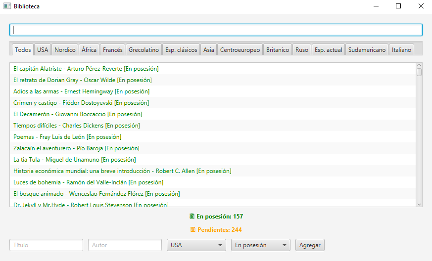

Proyecto creado por Pablo Marcos Sánchez. | Última actualización -> Febrero 2026.

# App Biblioteca Personal

Este proyecto consiste en una aplicación java de escritorio conectada a una BBDD remota (firebase).
Nos permite añadir libros, filtrar por autor, título, pais/época y si está en posesión o pendiente.

